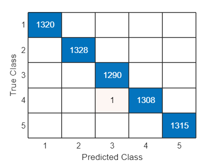
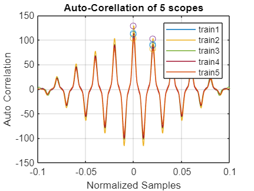
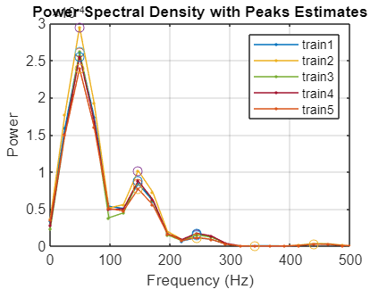
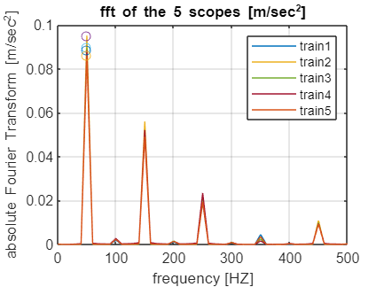

# **Project Machine Learning - Scope Classification**
# Loading Data

```matlab:Code
clear all
load project.mat
fs = 50e3;
section_len = 5e3;
```

# Training The Models

```matlab:Code
[mdl, norm_center, norm_scale] = getMdl(train1,train2,train3,train4,train5,fs,section_len);
```

```text:Output
mdlLoss = 1.6081e-04
```



# Getting The Prediction

```matlab:Code
prediction = zeros(150,1);
for i = 1:length(test)
    prediction(i) = mdlPredict(test{i}(1:section_len),mdl,norm_center,norm_scale,fs);
end
```

## saving the predictions

```matlab:Code
save('ytest','prediction') 
```

# Feature Visualization
## Auto Correlation

```matlab:Code
plotAutoCorrelation(train1,train2,train3,train4,train5)
```



## PSD

```matlab:Code
plotPSD(train1,train2,train3,train4,train5)
```



## Fourier Transform

```matlab:Code
plotFFT(train1,train2,train3,train4,train5)
```


